```mermaid
graph TD
    subgraph "Discord Bot"
        A[User Input] -->|1| B[bot.on_message]
        B -->|2| C[log_message]
        B -->|3| D[generate_response]
        D -->|4| E[play_music]
        D -->|5| F[text_to_audio]
        B -->|6| G[handle_temperature_command]
        H[bot.event] -->|7| I[update_presence]
    end

    subgraph "OpenAI Integration"
        D -->|3.1| J[AzureOpenAI client]
        J -->|3.2| K[assistant.create]
        K -->|3.3| L[thread.create]
        L -->|3.4| M[thread.messages.create]
        M -->|3.5| N[thread.runs.create]
        N -->|3.6| O[thread.runs.retrieve]
        O -->|3.7| P[thread.messages.list]
    end

    subgraph "Music Handling"
        E -->|4.1| Q[YTDLSource.from_url]
        Q -->|4.2| R[voice_client.play]
        S[play_next] -->|4.3| T[load_queue]
        S -->|4.4| U[remove_from_queue]
    end

    subgraph "Audio Processing"
        F -->|5.1| V[ElevenLabs client]
        V -->|5.2| W[client.generate]
    end

    subgraph "Temperature Handling"
        G -->|6.1| X[read_temperature_file]
        G -->|6.2| Y[generate_response]
        G -->|6.3| Z[write_temperature_file]
    end

    classDef discord fill:#7289DA,stroke:#5B6EAE,color:#FFFFFF
    classDef openai fill:#412991,stroke:#2C1B5A,color:#FFFFFF
    classDef music fill:#1DB954,stroke:#1A9E48,color:#FFFFFF
    classDef audio fill:#FF6B6B,stroke:#CC5757,color:#FFFFFF
    classDef temp fill:#4ECDC4,stroke:#45B7AE,color:#FFFFFF

    class A,B,C,H,I discord
    class D,J,K,L,M,N,O,P openai
    class E,Q,R,S,T,U music
    class F,V,W audio
    class G,X,Y,Z temp

    click B callback "bot.on_message###src/bot.py###@bot.event\nasync def on_message(message):"
    click C callback "log_message###src/message_logger.py###def log_message(message):"
    click D callback "generate_response###src/openai_utils.py###def generate_response(prompt):"
    click E callback "play_music###src/music_handler.py###async def play_music(ctx, song_request):"
    click F callback "text_to_audio###src/elevenlabs.py###async def text_to_audio(text, filename):"
    click G callback "handle_temperature_command###src/temperature_handler.py###def handle_temperature_command(author):"
    click I callback "update_presence###src/rich_presence.py###@tasks.loop(minutes=5)\nasync def update_presence(rpc, bot):"
    click J callback "AzureOpenAI client###src/openai_utils.py###client = AzureOpenAI("
    click Q callback "YTDLSource.from_url###src/music_handler.py###@classmethod\nasync def from_url(cls, url, *, loop=None, stream=False):"
    click R callback "voice_client.play###src/music_handler.py###ctx.voice_client.play(player, after=lambda e: asyncio.run_coroutine_threadsafe(on_song_end(ctx), ctx.bot.loop))"
    click S callback "play_next###src/music_handler.py###async def play_next(ctx):"
    click T callback "load_queue###src/music_handler.py###def load_queue():"
    click U callback "remove_from_queue###src/music_handler.py###def remove_from_queue():"
    click V callback "ElevenLabs client###src/elevenlabs.py###client = ElevenLabs(api_key=API_KEY)"
    click W callback "client.generate###src/elevenlabs.py###audio = client.generate("
    click X callback "read_temperature_file###src/temperature_handler.py###with open(temperature_file_name, 'r', encoding='utf-8') as file:"
    click Y callback "generate_response###src/temperature_handler.py###response = generate_response(prompt)"
    click Z callback "write_temperature_file###src/temperature_handler.py###with open(temperature_file_name, 'w', encoding='utf-8') as file:"

    click A_B edge_callback "User Input to bot.on_message###src/bot.py###if message.author == bot.user:"
    click B_C edge_callback "bot.on_message to log_message###src/bot.py###log_message(message)"
    click B_D edge_callback "bot.on_message to generate_response###src/bot.py###response = generate_response(prompt)"
    click B_E edge_callback "bot.on_message to play_music###src/bot.py###await play_music(await bot.get_context(message), song_request)"
    click B_F edge_callback "bot.on_message to text_to_audio###src/bot.py###await text_to_audio(text, filename)"
    click B_G edge_callback "bot.on_message to handle_temperature_command###src/bot.py###handle_temperature_command(author)"
    click D_J edge_callback "generate_response to AzureOpenAI client###src/openai_utils.py###client = AzureOpenAI("
    click J_K edge_callback "AzureOpenAI client to assistant.create###src/openai_utils.py###assistant = client.beta.assistants.create("
    click K_L edge_callback "assistant.create to thread.create###src/openai_utils.py###thread = client.beta.threads.create()"
    click L_M edge_callback "thread.create to thread.messages.create###src/openai_utils.py###client.beta.threads.messages.create("
    click M_N edge_callback "thread.messages.create to thread.runs.create###src/openai_utils.py###run = client.beta.threads.runs.create("
    click N_O edge_callback "thread.runs.create to thread.runs.retrieve###src/openai_utils.py###run = client.beta.threads.runs.retrieve("
    click O_P edge_callback "thread.runs.retrieve to thread.messages.list###src/openai_utils.py###messages = client.beta.threads.messages.list("
    click E_Q edge_callback "play_music to YTDLSource.from_url###src/music_handler.py###player = await YTDLSource.from_url(next_song['url'], loop=ctx.bot.loop)"
    click Q_R edge_callback "YTDLSource.from_url to voice_client.play###src/music_handler.py###ctx.voice_client.play(player, after=lambda e: asyncio.run_coroutine_threadsafe(on_song_end(ctx), ctx.bot.loop))"
    click S_T edge_callback "play_next to load_queue###src/music_handler.py###queue = load_queue()"
    click S_U edge_callback "play_next to remove_from_queue###src/music_handler.py###remove_from_queue()"
    click F_V edge_callback "text_to_audio to ElevenLabs client###src/elevenlabs.py###client = ElevenLabs(api_key=API_KEY)"
    click V_W edge_callback "ElevenLabs client to client.generate###src/elevenlabs.py###audio = client.generate("
    click G_X edge_callback "handle_temperature_command to read_temperature_file###src/temperature_handler.py###with open(temperature_file_name, 'r', encoding='utf-8') as file:"
    click G_Y edge_callback "handle_temperature_command to generate_response###src/temperature_handler.py###response = generate_response(prompt)"
    click G_Z edge_callback "handle_temperature_command to write_temperature_file###src/temperature_handler.py###with open(temperature_file_name, 'w', encoding='utf-8') as file:"

```

# Discord Azure Bot

# Sumário

- [Visão Geral](#visão-geral)
- [Funcionalidades](#funcionalidades)
  - [Interação Personalizada](#interação-personalizada)
  - [Armazenamento e Análise de Mensagens](#armazenamento-e-análise-de-mensagens)
  - [Regra das 5 Mensagens](#regra-das-5-mensagens)
- [Como Funciona](#como-funciona)
- [Requisitos](#requisitos)
- [Deploy Manual](#deploy-manual)
- [Deploy com Docker](#deploy-com-docker)
- [Estrutura](#estrutura)

## Visão Geral

O **Discord Azure Bot** é um bot inteligente projetado para interagir com os usuários no Discord de maneira dinâmica e personalizada. Utilizando a tecnologia Azure OpenAI, o bot não apenas responde às mensagens dos usuários, mas também analisa o comportamento e a personalidade de cada um, criando uma experiência única para cada interação.

## Funcionalidades

### Interação Personalizada

- **Resposta Adaptativa**: O bot analisa as últimas 30 mensagens de cada usuário e usa essa análise para adaptar suas respostas. Isso significa que o bot pode responder de maneira diferente para cada usuário, ajustando seu tom e estilo de comunicação com base na interação passada. Assim, o mesmo usuário pode receber respostas mais elegantes, mais diretas, ou até mesmo nenhuma resposta, dependendo do contexto.

### Armazenamento e Análise de Mensagens

- **Armazenamento de Mensagens**: O bot armazena todas as mensagens enviadas pelos usuários em um banco de dados. Isso é usado para entender melhor o estilo de comunicação e o comportamento de cada usuário.
- **Análise de Personalidade**: Através da análise das últimas 30 mensagens, o bot cria um perfil de personalidade para cada usuário. Esta análise é usada para personalizar as respostas e garantir que as interações sejam únicas e relevantes.

### Regra das 5 Mensagens

- **Interação a Cada 5 Mensagens**: O bot segue uma regra de interação que considera as últimas 5 mensagens no chat. Isso garante que o bot não responda a todas as mensagens, mas apenas a cada 5 mensagens, mantendo a conversa mais fluida e menos intrusiva.

## Como Funciona

1. **Análise Contínua**: O bot monitora as mensagens enviadas pelos usuários e armazena essas mensagens para análise futura.
2. **Geração de Resposta**: Com base na análise das últimas 30 mensagens, o bot gera uma resposta personalizada para cada usuário.
3. **Interação Específica**: O bot responde a cada 5 mensagens no chat, utilizando as últimas 5 mensagens para determinar a melhor forma de interagir.


## Requisitos

- Python 3.8 ou superior
- Uma conta de Discord e um token de bot
- Uma conta Azure com Azure OpenAI

## Deploy Manual

1. Clone este repositório:

```bash
git clone https://github.com/yourusername/discord-azure-bot.git
cd discord-azure-bot

python -m venv venv
source venv/bin/activate  # No Windows use `venv\Scripts\activate`
$env:PYTHONPATH = "."
pip install -r requirements.txt
```

2. Crie um arquivo `.env` na raiz do projeto com as seguintes variáveis:

```bash
DISCORD_TOKEN=seu_discord_token_aqui
GUILD_ID=seu_guild_id
CHANNEL_ID=seu_channel_id
AZURE_OPENAI_API_KEY=sua_chave_openai_aqui
AZURE_OPENAI_ENDPOINT=seu_endpoint_openai
AZURE_OPENAI_DEPLOYMENT=nome_do_seu_deployment
```

4. Execute o bot:

```bash
python src/bot.py
```
## Deploy com Docker

1. Clone este repositório:

```bash
git clone https://github.com/yourusername/discord-azure-bot.git
cd discord-azure-bot
```

2. Crie um arquivo `.env` na raiz do projeto com as seguintes variáveis:

```bash
DISCORD_TOKEN=seu_discord_token_aqui
GUILD_ID=seu_guild_id
CHANNEL_ID=seu_channel_id
AZURE_OPENAI_API_KEY=sua_chave_openai_aqui
AZURE_OPENAI_ENDPOINT=seu_endpoint_openai
AZURE_OPENAI_DEPLOYMENT=nome_do_seu_deployment
```

3. Construa a imagem Docker:

- Se estiver usando apenas o Dockerfile, execute:
```bash
docker build -t discord-azure-bot .
docker run -d --name discord-azure-bot --env-file .env discord-azure-bot

```

- Se estiver usando o Docker Compose, execute:
```bash
docker-compose up -d
```

## Estrutura

- `src/`: Contém o código-fonte do bot e suas funcionalidades.
- `logs/`: Diretório onde são armazenados os arquivos de log das mensagens.
- `.env`: Arquivo de variáveis de ambiente (não deve ser comitado).
- `requirements.txt`: Arquivo com as dependências do projeto.

```shell
discord-bot/
│
├── src/
│   ├── __init__.py            # Indica que o diretório é um módulo Python
│   ├── bot.py                 # Arquivo principal do bot que conecta tudo
│   ├── openai_utils.py        # Módulo de interação com Azure OpenAI
│   ├── message_logger.py      # Módulo responsável por registrar as mensagens
│   └── discord_utils.py       # Módulo de utilidades para interagir com a API do Discord
│   └── temperature_utils.py   # Módulo de utilidades para calcular a temperatura de resposta
│
├── logs/                      # Diretório onde serão salvos os arquivos de log em JSON
│
├── .env                       # Arquivo para variáveis de ambiente (não deve ser comitado)
├── requirements.txt           # Dependências do projeto
├── README.md                  # Arquivo de documentação
├── .gitignore                 # Arquivo para ignorar arquivos e pastas no Git
└── tests/
    ├── test_openai_utils.py    # Testes para a função que interage com a API da OpenAI
    ├── test_message_logger.py  # Testes para a função de logging

```


